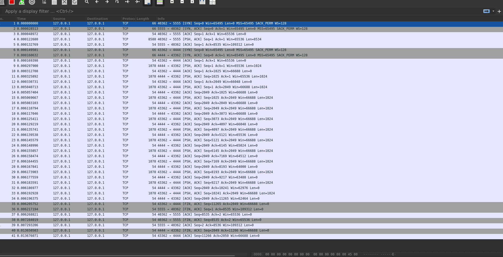

## PoC 12: E2EE traffic padding

### Usage:
```
$ cargo run -- server [server-listen-port]
$ cargo run -- client [client-listen-port] [server-listen-port]
```

Client listens on client-listen-port, pads traffic, encrypts traffic. Then, client sends traffic to server:server-listen-port. Server decrypts traffic, identifies how much padding there is. Padding can easily be stripped.


### Demo
```
# (Window 1, netcat)
$ wc -c file.small
3000 file.small

$ wc -c file.big
8534 file.big

# (Window 2, server)
$ cargo run -- server 4444
   Compiling e2ee-traffic-padding v0.0.0 (/home/user/Datura-Network/Poc/12-e2ee-traffic-padding)
    Finished `dev` profile [unoptimized + debuginfo] target(s) in 0.18s
     Running `target/debug/e2ee-traffic-padding server 4444`
[Node B] Listening on 4444

# (Window 3, client)
$ cargo run -- client 5555 4444
    Finished `dev` profile [unoptimized + debuginfo] target(s) in 0.04s
     Running `target/debug/e2ee-traffic-padding client 5555 4444`
[Node A] Listening on 5555
[Node A] Will connect to Node B on 4444

# (Window 1, netcat)
$ nc 127.0.0.1 5555 < file.small

# (Window 3, client)
[Node A] Listening on 5555
[Node A] Will connect to Node B on 4444
[Node A] Received encapsulation key from Node B
[Node A] Sent ciphertext to Node B
[Node A] Unencrypted size: 3056 bytes
[Node A] Unencrypted hash: 4643444102681459916
[Node A] Encrypted size: 3072 bytes
[Node A] Encrypted hash: 6482957275098753518
[Node A] Number of padding bytes: 56
[Node A] Sending 3 packets

# (Window 2, server)
[Node B] Listening on 4444
[Node B] Sent encapsulation key to Node A
[Node B] Received ciphertext from Node A
[Node B] Encrypted size: 3072 bytes
[Node B] Encrypted hash: 6482957275098753518
[Node B] Decrypted size: 3056 bytes
[Node B] Decrypted hash: 4643444102681459916
[Node B] Len padding: 56

# (Window 1, netcat)
$ nc 127.0.0.1 5555 < file.big

# (Window 3, client)
[Node A] Received encapsulation key from Node B
[Node A] Sent ciphertext to Node B
[Node A] Unencrypted size: 9200 bytes
[Node A] Unencrypted hash: 6114876774959739171
[Node A] Encrypted size: 9216 bytes
[Node A] Encrypted hash: 5211964730373874226
[Node A] Number of padding bytes: 666
[Node A] Sending 9 packets

# (Window 2, server)  
[Node B] Sent encapsulation key to Node A
[Node B] Received ciphertext from Node A
[Node B] Encrypted size: 9216 bytes
[Node B] Encrypted hash: 5211964730373874226
[Node B] Decrypted size: 9200 bytes
[Node B] Decrypted hash: 6114876774959739171
[Node B] Len padding: 666

```




Screenshot of wireshark during sending file.big. The first 8588 byte packet is from netcat. After that, all PSH/ACK packets are 1078 bytes (1024 + 54), even KEM packets (although, they remain padded with 0s, as mentioned in a comment in the code).