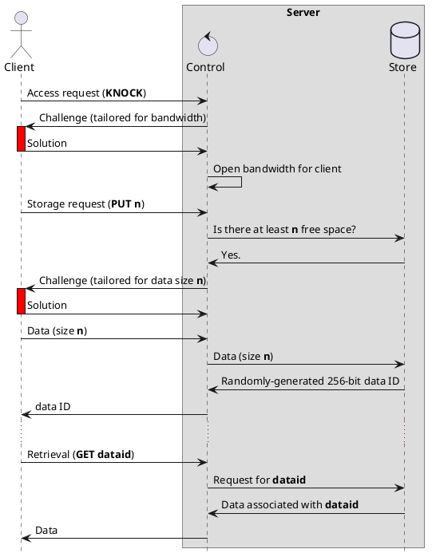

This PoC heavily builds upon 6.1-alloc-bandwidth and 6-throttling. The documentation
concerning bandwidth and challenge management are in these two subprojects.

```plantuml
@startuml
actor Client
box "Server"
control Control
database Store
end box

hide footbox

Client -> Control : Access request (**KNOCK**)

Client <- Control ++ #red : Challenge (tailored for bandwidth)
Client -> Control -- : Solution

Control -> Control : Open bandwidth for client

Client -> Control : Storage request (**PUT n**)

Control -> Store : Is there at least **n** free space?
Control <- Store : Yes.

Client <- Control ++ #red : Challenge (tailored for data size **n**)
Client -> Control -- : Solution

Client -> Control : Data (size **n**)
Control -> Store : Data (size **n**)
Control <- Store : Randomly-generated 256-bit data ID
Client <- Control : data ID

...

Client -> Control : Retrieval (**GET dataid**)
Control -> Store : Request for **dataid**
Control <- Store : Data associated with **dataid**
Client <- Control : Data
@enduml
```
