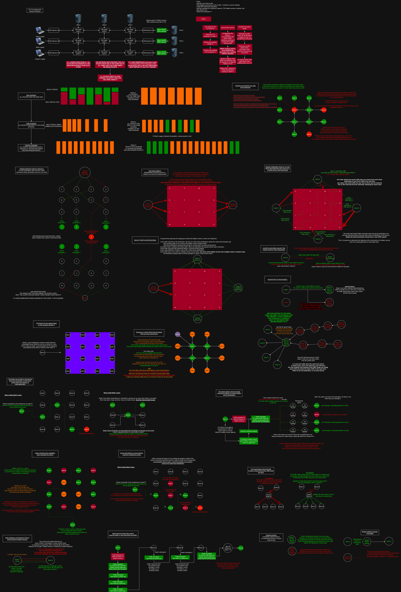

# Nowhere-Network (WIP)

Nowhere Network is a new Darknet (like Tor or I2P), that is going to be written in rust. It will be designed in such a way that state-level threats of passive network analysis, and active sybil attacks are rendered useless to conduct against it's defenses. 

In other words, Nowhere Network will provide anonymity on the TCP/IP layer at all costs, while maintaining usability of the network.

# Roadmap:

```
DOING:
-Phase 1: (Visualizing)
    - Brainstorming how the network should work and it's features (to defend against all threats)
    - Brainstorming the threat model (Passive, Active and Forceful adversaries)

TODO:
-Phase 1.5: (Testing the Proof of Concepts)
    - Making a barebones binary with local socks5 proxying and tcp port binding to further explain the threat model (and what the adversary can see)
    - Making PoCs of the critical features of the network to clarify what's possible and what's not possible:
        - Vanity v3 hidden service names, with easy retrieval of hidden services' public keys (the hidden service name alone should be enough to get the public key of a hidden service, to encrypt traffic with it)
        - Rust TCP packet handling, E2EE encryption (with post quantum algos?), and decryption on the other end.
            -> Benchmarking how quickly we can recieve packets, decrypt them and afterward forward them to the next hop (ideally 3mbps in and 3mbps out!) (Node A -> Node B -> Node C)
        - Distributed Hash table: with the hash of a hidden service: quickly finding the closest nodes on a hashring
        - RandomX Challenges with variable difficulty (benchmarks on an average consumer laptop), and showcasing the challenge and solution format
        - Zero Knowledge Proofs (Input: rdv node hash, expiration timestamp, hidden service hash, validated randomX challenge. Output: ZKP (that must be verifiable as either valid or invalid with the same inputs by other nodes.)
        - Rust Libp2p UDP Hole punching for nodes behind NATs
        - Rust TCP packet traffic padding (both in packet sizes and in packet sending intervals)
        - Rust SOCKS5 Proxying : tcp + udp ?
        - Routing rules for nodes: packet recieved, packet decrypted, it says "this packet is for hash 44AWD", it matches a routing rule (packet for hash 44AWD = route this to node hash 88QWD) -> node routes packet to the node whose hash is 88QWD
- Phase 2: (Clarifying the Vision)
    - Writing the specification of all of the network features, 
        (once we have a clear idea of how the network should function with all the above PoCs (in text format))
- Phase 3: (Making the basic routing functionnality of the network)
    - v0.0.1 : Basic binary with local socks5 proxying, and tcp port binding
    - v0.0.2 : Nodes all have a default hidden service, and use that as their hash to identify themselves. (which is also used to recieve E2EE packets)
    - v0.0.3 : Nodes can be asked to give randomX challenges, and Nodes can be given those randomx challenges solutions, and they can tell if they're valid or invalid.
    - v0.0.4: nodes can ask nodes closest to the hidden service's hash (or BS hashes) to route packets for them either as rendezvous nodes or nodes in between RDVs and themselves. In exchange for valid RandomX solutions
    - v0.0.5 : Clients can decide where their circuits can go through (unidirectionnal streams), and the packets are encrypted using the destination node's public key.
    - v0.0.6 : Clients can ask destination nodes to route packets back through a rendezvous node that they themselves picked.
    - v0.0.7: Knowledge of a given hidden service's rendezvous node is propagating throughout the network (further outward from where rendezvous is, on the hashring), progressively. (the least likely place to find the knowledge is on the other side of the hashring.)
    - v0.1: Fully functionnal Hidden service DNS resolution and dual, uni-directionnal packet routing. (with double rendezvous points)
    - v0.1-6: Making the network protect against all traffic analysis threats:
        - (Packet padding, decoy destinations, + E2EE, etc)
    - v0.6-9: Network protects against both DDoS and sybil attacks: (decentralized verifying trust system)
Phase 4: Stressnet phase
    - v0.9.0-5: Double and triple check that all attacks are neutralized, ideally with an independant audit
        -> everyone must behave like the adversary would behave and document what they find along the way
    - v0.9.5-9: fix all the weaknesses discovered by the above audits
Phase 5: Network Release
    - v1.0.0: ramping up the SEO as much as possible
```



