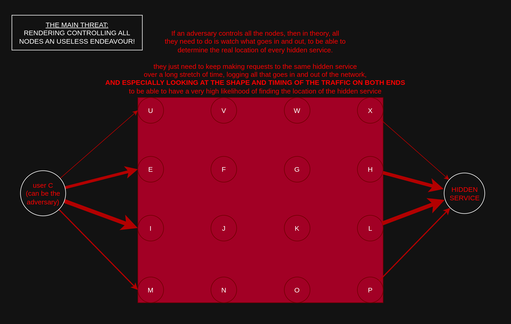
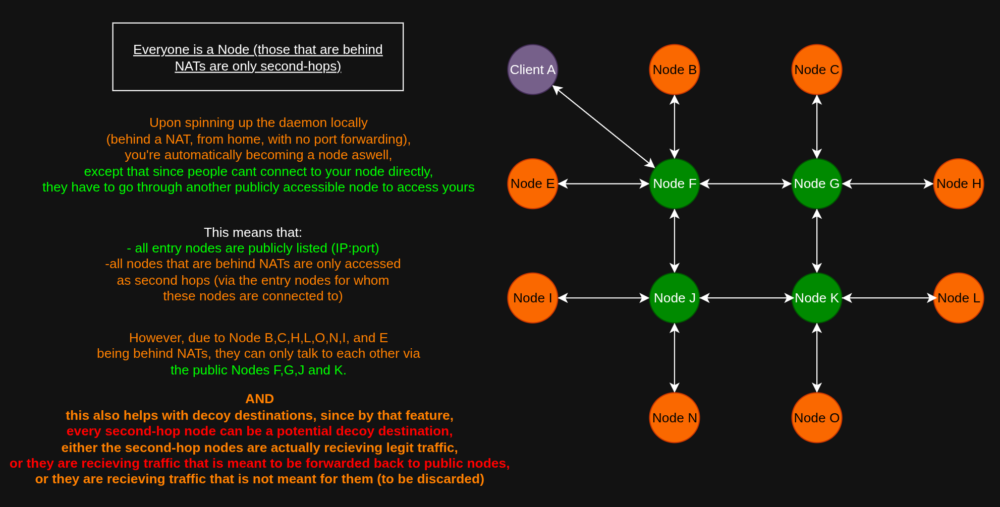
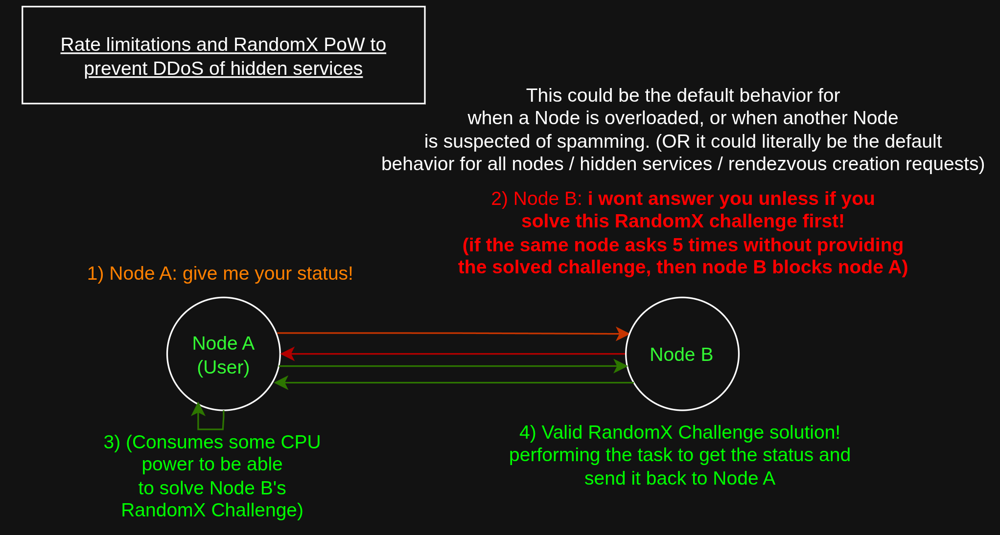
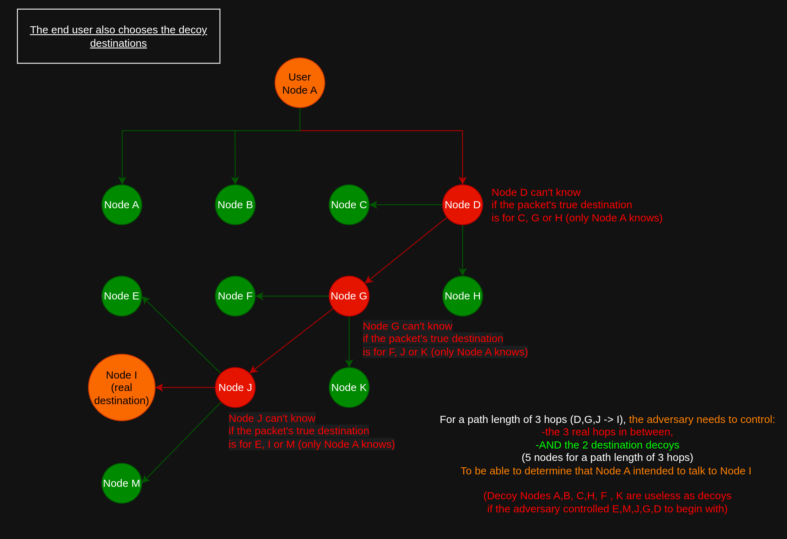
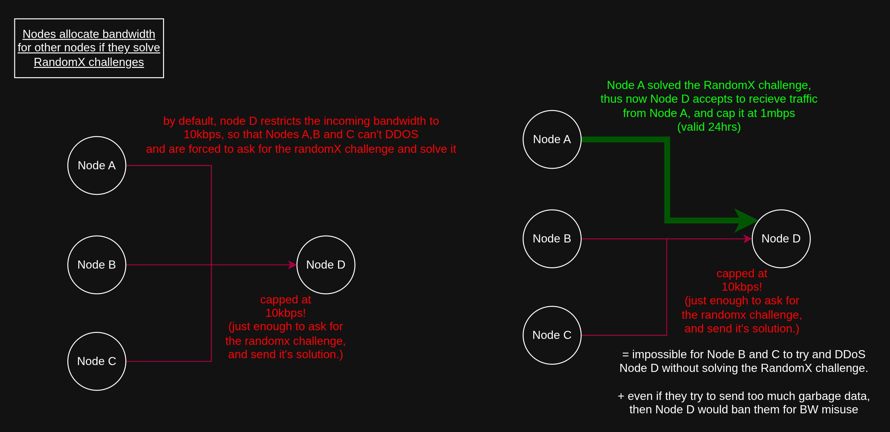
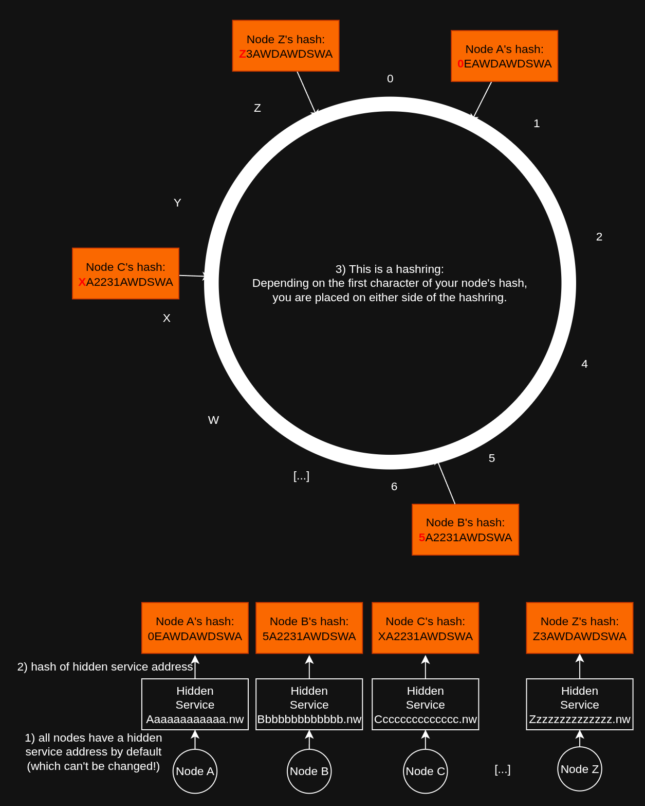
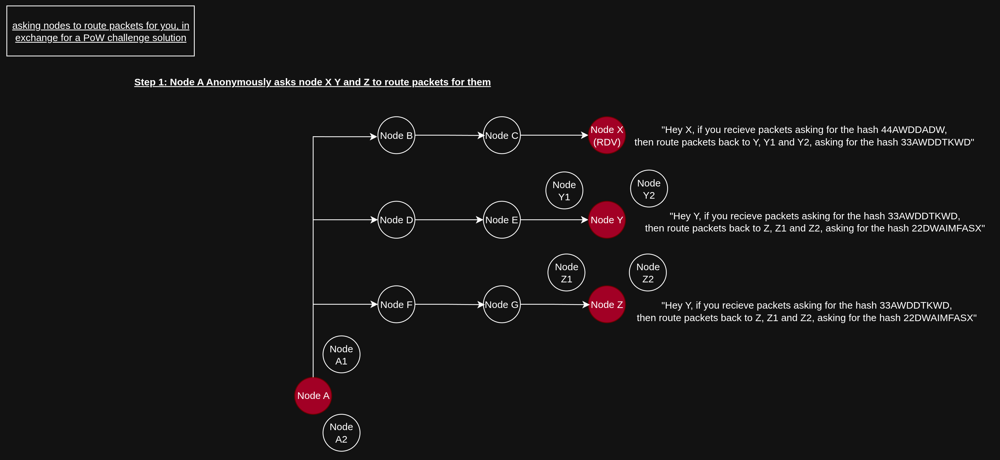
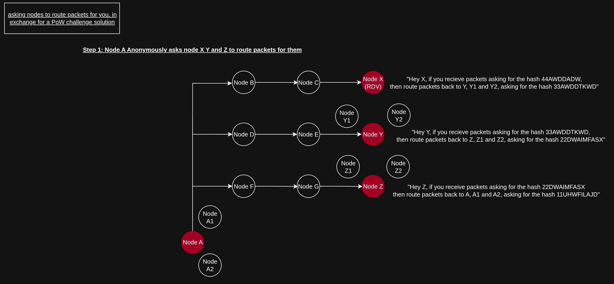
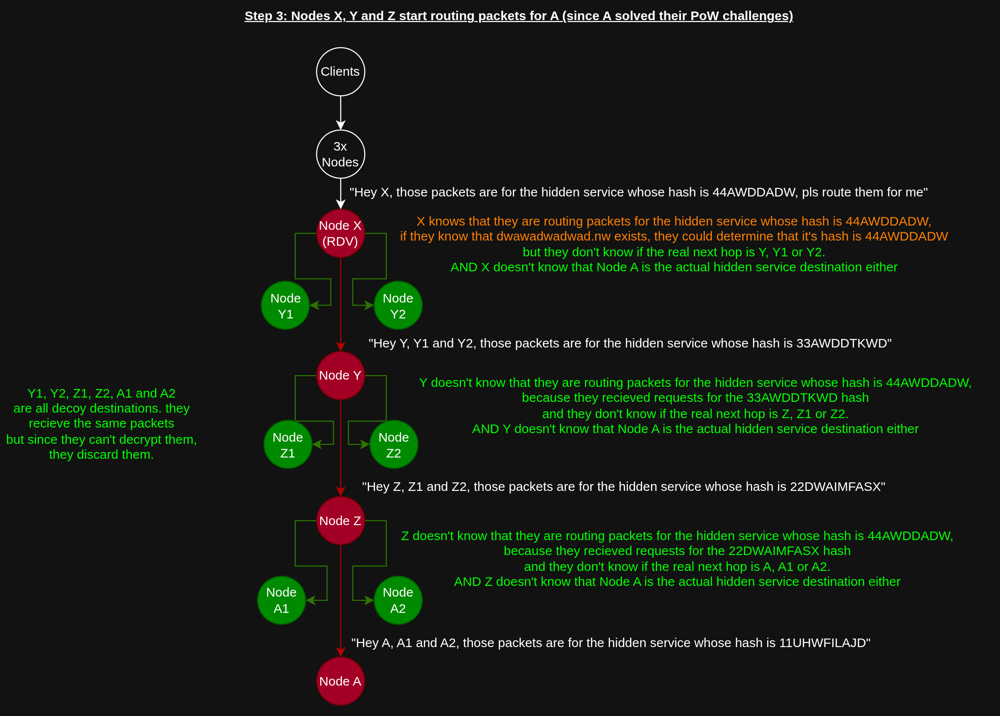

# Datura Network

## Threat Model

The threat landscape that is in scope spans the following 3 categories: 

### Passive Adversary Threats (Traffic Correlation Attacks)

Passive adversary threats include for example a malicious Internet Service Provider logging connections to perform traffic correlation attacks. By looking at shape of the traffic coming from the source, and by looking at the shape of the traffic on the other end, the adversary may be able to determine that the source is actually communicating with that destination.

The shape of the traffic (the size of the packets, the amount of data being sent, the timing at which each packet is sent, the destination as of where the packets are going), these are all characteristics that the adversary can use to deanonymize users based on their traffic patterns.

The connection/traffic logging is also long-lived, and can span several months, and can be used to correlate that client A communicated with server B.

### Active Adversary Threats (Sybil Attacks)

Active adversary threats include for example a malicious administrator running nodes for the network, except that the software being ran has been customized to log every connection, from the source to the destination, to the amount of traffic transiting through the malicious nodes.

The Active adversary tries to run as many nodes as possible on the network to try and ensure that clients pick only their nodes for their entire connection circuits, and if they do so, then that means the adversary is able to log the connections of those clients that only picked their nodes as hops. By looking at what goes in their nodes, and what exits their nodes, they can tell that client A communicated to server B.

### Disruptive Adversary Threats (DDoS Attacks)

Disruptive adversary threats include malicious actions that the adversary does to harm the usability of the network, either to slow down it's performance, or to bring it to a complete halt, which would effectively prevent client A from communicating to server B.

## Goals of the Network

The main goal of the network is to ensure that Client A can communicate to Server B without revealing either the identity (IP address) of client A to Server B, nor the revealing the identity (IP address) of Server B to Client A, because either client A or Server B could also be the adversary. The Anonymity provided by the network must be bi-directionnal, and on the IP layer (Both TCP and UDP).

To provide anonymity on the IP layer, the network must:

- Defeat all passive adversary threats, including traffic correlation attacks.
- Defeat all active adversary threats, including sybil attacks

A side-goal of the network is also to provide Anonymity on the IP layer, for clearnet internet usecases (for both TCP and UDP traffic aswell).

And lastly, the network must be able to actually route traffic for it's users, it must remain usable.

The goal of the network is **Anonymity at all costs, without making the network unusable.**

## Fundamental Features of the Network

### What are Nodes ?

A node can be a computer, a desktop, a laptop, a mobile device, a VPS, or a dedicated server, which is running the Datura daemon. 

### The Nodes that are accessible via their public IP address (VPSes / Dedicated servers), are publicly listed as first hops

The nodes which are accessible via their public IPs, such as VPSes or Dedicated servers are publicly listed as first hops, because those are enabling every other node in the network to connect and join the network.

### All clients are nodes (even behind NATs), and they connect to each other

The moment you run the datura client daemon, you are now a node, which means that other nodes can ask you to route traffic for them, and same goes for you, you can ask them to route traffic for you.

You can be behind a NAT (like at home behind a router), running the datura daemon from your laptop / desktop, and you are also a node anyway. It's just that you are a second-hop node!

2 Nodes that are both behind NATs can connect to each other via UDP hole punching, using a first-hop VPS/dedicated node to be able to establish a connection to one another.

### Nodes Connections (dual uni-directionnal streams + probabilistic path lengths):

Nodes always connect to one another using two uni-directionnal streams:

- A -> B -> C -> D -> E (A sends traffic to E via B,C and D)
- A <- H <- G <- F <- E (E responds to A via F, G and H)

The path length varies at random, to add uncertainty (for an external observer), as to which node is the source, and which node is the destination:

- A -> B -> C -> D -> E (minimal path length = 3 hops)
- A -> B -> C -> D -> I -> J -> K -> L -> E (maximum path length = 7 hops)

the path length of each connection is chosen at random.

### Nodes communication are End to End Encrypted (E2EE)

Each Node has a private key and a public key pair. The public Key is used by every other node to encrypt traffic that only the destination can decrypt.

### Nodes Pay for connections by solving RandomX Challenges

As a node, you will only accept to route traffic for other nodes if they manage to solve a randomX challenge which you set. 

- A -> E : "Hey E, route traffic for me!"
- A <- E : "i'll do it only if you solve this randomx challenge A!"
- A -> E : "Ok here's the randomX solution!" (E now unlocks the bandwidth from A to E to be 1mbps instead of 10kbps)
- A <- E : "Ok valid answer, i accept to route 1gb of traffic for you, at 1mbps!"

### Clients choose where their connections go, including which Nodes are used as Decoy Destinations

### Nodes limit the bandwidth usage of other nodes to 10kbps by default, until they solve their PoW challenge.

### Hidden Services (Vanity V3 addresses)

### Every Node has a default hidden service, which is used to identify the node by the hidden service's hash, and to place the node somewhere on a hashring.

### TODO: Hidden Service Destinations can select Rendez-vous nodes to recieve traffic from the clients

### TODO: The knowledge of where the Rendezvous nodes are propagates starting from the nodes whose hash are the closest to the hidden service's hash on the hashring

### Nodes can ask other nodes to route traffic for them, depending on the requested hash

### Exit Nodes to access the clearnet 

### Exit Nodes to access other Darknets (like Tor and i2p)

