# Datura Network Specification v0.3 (DRAFT)

## The Threat Model

The threat landscape that is in scope spans the following 3 categories: 

### Passive Adversary Threats (Traffic Correlation Attacks)

Global Passive Adversary (GPA) threats include multiple malicious Internet Service Provider logging connections to perform traffic correlation attacks. By looking at shape of the traffic coming to and from all nodes, the adversary may be able to determine that a given source client is actually communicating with that service destination, to be able to deanonymize them.


The shape of the traffic (the size of the packets, **and especially the amount of data being sent and recieved**, the timing at which each packet is sent, the destination as of where the packets are going), these are all characteristics that the adversary can use to deanonymize users based on their traffic patterns.

The connection/traffic logging is also long-lived, and can span several months, and can be used to correlate that client A communicated with server B.

### Active Adversary Threats (Sybil Attacks)


Active adversary threats include for example a malicious administrator running nodes for the network, except that the software being ran has been customized to log every connection, from the source to the destination, to the amount of traffic transiting through the malicious nodes.

The Active adversary tries to run as many nodes as possible on the network to try and ensure that clients pick only their nodes for their entire connection circuits, and if they do so, then that means the adversary is able to log the connections of those clients that only picked their nodes as hops. By looking at what goes in their nodes, and what exits their nodes, they can tell that client A communicated to server B.

### Disruptive Adversary Threats (DDoS Attacks)

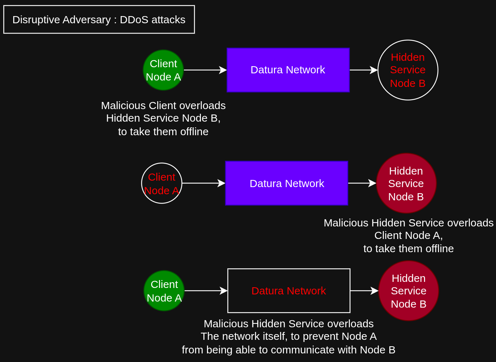

Disruptive adversary threats include malicious actions that the adversary does to harm the usability of the network, either to slow down it's performance, or to bring it to a complete halt, which would effectively prevent client A from communicating to server B. It also includes malicious clients and Malicious Hidden Services trying to take one another offline.

## Goals of the Network

The main goal of the network is to ensure that Client A can communicate to Server B without revealing either the identity (IP address) of client A to Server B, nor the revealing the identity (IP address) of Server B to Client A, because either client A or Server B could also be the adversary. The Anonymity provided by the network must be bi-directionnal, and on the IP layer (Both TCP and UDP).

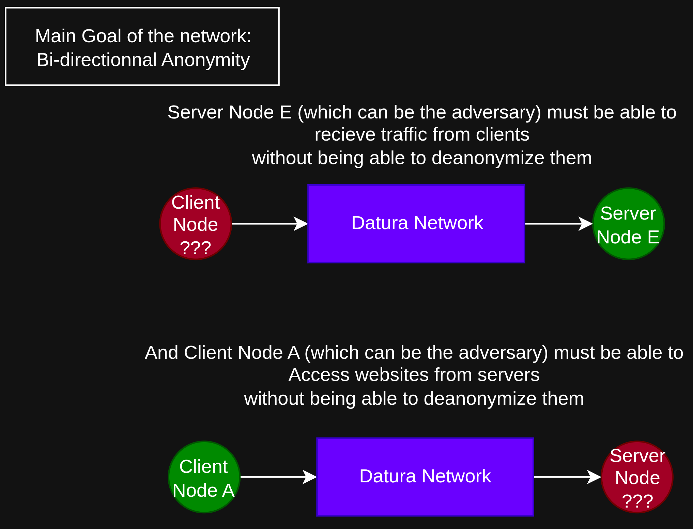

To provide anonymity on the IP layer, the network must:

- Defeat all passive adversary threats, including traffic correlation attacks.
- Defeat all active adversary threats, including sybil attacks

A side-goal of the network is also to provide Anonymity on the IP layer, for clearnet internet usecases (for both TCP and UDP traffic aswell).

And lastly, the network must be able to actually route traffic for it's users, it must remain usable.

The goal of the network is **Anonymity at all costs, without making the network unusable.**

## Fundamental Features of the Network

### What are Nodes ?

A node can be a computer, a desktop, a laptop, a mobile device, a VPS, or a dedicated server, which is running the Datura daemon. 

### The Nodes that are accessible via their public IP address (VPSes / Dedicated servers), are publicly listed as first hops


The nodes which are accessible via their public IPs, such as VPSes or Dedicated servers are publicly listed as first hops, because those are enabling every other node in the network to connect and join the network.

### All clients are nodes (even behind NATs), and they connect to each other


The moment you run the datura client daemon, you are now a node, which means that other nodes can ask you to route traffic for them, and same goes for you, you can ask them to route traffic for you.

You can be behind a NAT (like at home behind a router), running the datura daemon from your laptop / desktop, and you are also a node anyway. It's just that you are a second-hop node!

2 Nodes that are both behind NATs can connect to each other via UDP hole punching, using a first-hop VPS/dedicated node to be able to establish a connection to one another.

### Nodes Connections (dual uni-directionnal streams + probabilistic path lengths):


Nodes always connect to one another using two uni-directionnal streams:

- A -> B -> C -> D -> E (A sends traffic to E via B,C and D)
- A <- H <- G <- F <- E (E responds to A via F, G and H)

The path length varies at random, to add uncertainty (for an external observer), as to which node is the source, and which node is the destination:

- A -> B -> C -> D -> E (minimal path length = 3 hops)
- A -> B -> C -> D -> I -> J -> K -> L -> E (maximum path length = 7 hops)

the path length of each connection is chosen at random.

### Nodes communication are End to End Encrypted (E2EE)

Each Node has a private key and a public key pair. The public Key is used by every other node to encrypt traffic that only the destination can decrypt.

### Nodes Pay for other nodes to either route or recieve their traffic by solving RandomX Challenges


As a node, you will only accept to route traffic for other nodes if they manage to solve a randomX challenge which you set. 

- A -> E : "Hey E, route traffic for me!"
- A <- E : "i'll do it only if you solve this randomx challenge A!"
- A -> E : "Ok here's the randomX solution!" (E now unlocks the bandwidth from A to E to be 1mbps instead of 10kbps)
- A <- E : "Ok valid answer, i accept to route 1gb of traffic for you, at 1mbps!"

### Clients choose where their connections go, including which Nodes are used as Decoy Destinations

For every connection that clients make, they are choosing multiple hops, in this example there are 3. And for each real destination hop along the way, there are also 2 other decoy destinations where the traffic is being sent to:

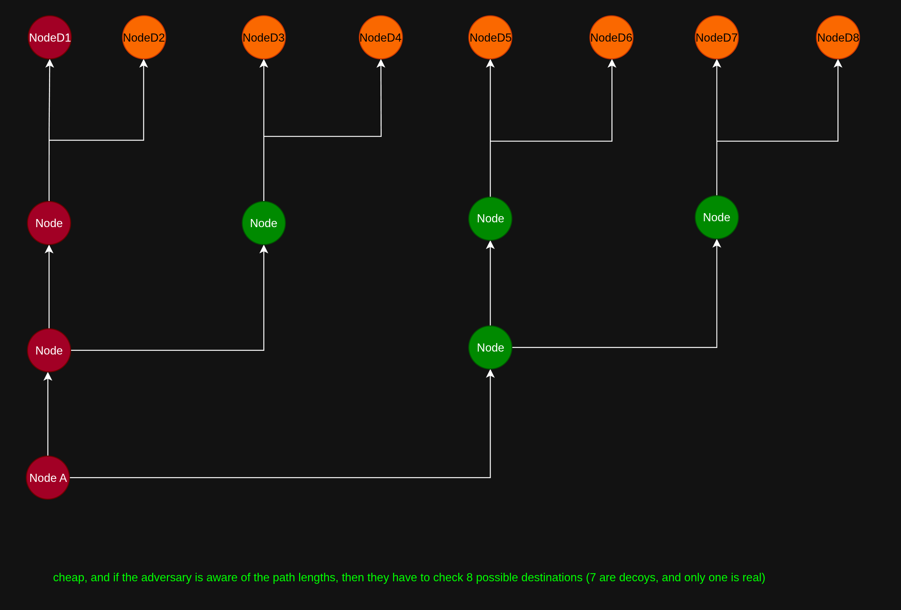

Every node along the way does not know what the traffic they recieve is for, until they try to decrypt it, where one of the 3 following scenarios can happen: 

- Either the node can decrypt the traffic and: 
    - either they forward the traffic to the next 3 nodes,
    - or that node was the intended destination and they process the request.
- Or else if the node can't decrypt the traffic and discard it as decoy traffic.

Important sidenote, **these decoy destinations are remembered on the clientside for future use, because long-term passive traffic correllation attacks are in scope in the threat model.** If an adversary can monitor the traffic activity of all nodes on the network (from an external point of view), in case of decoy / hop nodes constantly changing, the only point in common over time of the connections would be Node A and Node I.

### Nodes limit the bandwidth usage of other nodes to 10kbps by default, until they solve their PoW challenge.


By default, nodes cap incoming nodes traffic to 10kbps max, meaning just enough bandwidth to ask for randomX challenges and send their solutions. That way in case if a disruptive adversary tries to flood the network with traffic worth terabytes per second firepower, they can't do it due to the bandwidth constraints.

The only way to widen the bandwidth is to solve the RandomX challenge of the given node you want to route the traffic through, you have to spend CPU power to be able to do that, and that only unlocks the bandwidth to a set amount, allowing a set amount of traffic to go through (like 1gb for example), and that's only valid for a set amount of time (24 hours for example).

### Hidden Services (Vanity V3 addresses)

Hidden services can be on any node in the network, those are generated via ed25519 curves, with a private and public keypair. The ed25519 choice is there to ensure that it is statistically impossible for Node A to generate exact same keypair that Node B generated. 

As long as the keys to a given hidden service remain on the node that generated them, the hidden service permanently remains theirs, unless if someone hacks into the server to steal those keys.

The domain names (which are derived from the ed25519 keypair) are of the following format:

```
daturan24gtdy23lxd7ht3xzx6mi7mdlkabpvuefhrjn4t5jduviw5ad.dn
```

(The .dn at the end signifies datura network, but it could also just mean dark net).

**By default, only the node that generated the hidden service address knows what that hidden service address is.** They can choose to share that hidden service address with other clients that want to access it, but to do that the administrator needs to explicitely tell users (for example on simplex), to go tell them to check out their hidden service. 

If the administrator that generated the hidden service never shares the hidden service address to anyone, then they will always remain the only ones that know that this particular hidden service address exists.

if that hidden service address is to be referred to from within the network (excluding the end user clients), that hidden service must be referred to by it's hash:

```
daturan24gtdy23lxd7ht3xzx6mi7mdlkabpvuefhrjn4t5jduviw5ad.dn
HASHFUNCTION(daturan24gtdy23lxd7ht3xzx6mi7mdlkabpvuefhrjn4t5jduviw5ad.dn) =  0EAWDAWDSWA
```

The logic behind using the hash to refer to hidden services from inside the network is to first ensure that they are never referred to by their actual .dn addresses, and to ensure that what they are being referred to (their hash), cannot be used to determine what their .dn address is.

The only way to know if the 0EAWDAWDSWA hash refers to the daturan24gtdy23lxd7ht3xzx6mi7mdlkabpvuefhrjn4t5jduviw5ad.dn hidden service, is to know that hidden service address, and to try the hashing function on that hidden service address to arrive at the above hash. Unless if you are told what the hidden service address is, you cannot use the hash by itself to determine what it's source was.

### Every Node has a default hidden service, which is used to identify the node by the hidden service's hash, and to place the node somewhere on a hashring.

Every node has a hidden service by that is generated by default upon first starting up, the reason behind that is threefold:

- ensuring that they can be used as decoy destinations
- it allows us to take the hash of that hidden service and refer to that node by that hash.
- it allows us to place each node somewhere on the hashring:


If your node's default hidden service hash is dwwitra224gtdy23lxd7ht3xzx6mi7mdlkabpvuefhrjn4t5jduviw5ad.dn, and it's hash is Z3AWDAWDSWA, then your node is placed into the **Z* neighborhood on the hashring**.

If it's hash was 5A2231AWDSWA, then your node would be placed into the **5* neighborhood on the hashring**.

This allows us to publicly list nodes by their identifiers, for example on a small hashring of 4 nodes:

```
Node A: hash 0EAWDAWDSWA
Node B: hash 5A2231AWDSWA
Node C: hash XA2231AWDSWA
Node Z: hash Z3AWDAWDSWA
```

Sidenote: The default hidden service is not meant to be used as an actual hidden service, it's sole purpose is to ensure that nodes can be used as decoy destinations, and to place the node somewhere on the hashring.

The real hidden services (which can be websites for example) are the ones that are NOT Default:


Naturally, given the random nature of the non-default hidden services' hashes, those will point at different neighborhoods on the hashring. This does not mean that the node is placed anywhere else on the hashring, **the node's placement on the hashring is only determined by the it's default hidden service hash**


Nodes advertise themselves by their default hidden service's hash. In the above example, Node A's hash is 0EAWDAWDSWA, even if it also has 2 other non-default hidden services (whose hashes are W2AWDAWDSWA and 44AWDAWDSWA respectively).

### Hidden Service Destinations can select Rendez-vous nodes to recieve traffic from the clients

Let's say you are the above Node A, you have a non-default hidden service which you intend to use to anonymously host your website, to be reachable at the `daturan24gtdy23lxd7ht3xzx6mi7mdlkabpvuefhrjn4t5jduviw5ad.dn` hidden service.

You have let's say a userbase of 100 clients which know the hidden service address, **the problem is that they need to be told where to reach the hidden service without being told on which node the hidden service actually is.** (this is our bi-directionnal anonymity requirement, as stated above). This is where rendezvous nodes come into play.

You are Node A, and your clients need to somehow reach your website, without you telling them where it's actual destination is, so by default you pick a random node on the hashring to become your rendezvous node:

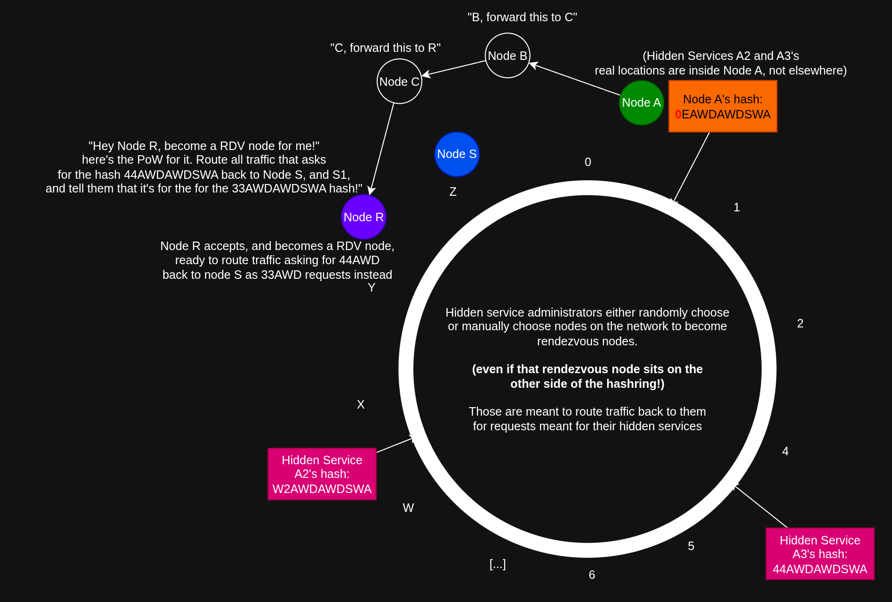

(Sidenote: we'll also allow hidden service administrators to CHOOSE their rendezvous nodes manually if they want to)

In the above example, Node A just asked Node R to route traffic meant for the hidden service whose hash is 44AWDAWDSWA back to Node S, asking for the 33AWDAWDSWA hash instead. This was done by completing a completing PoW challenge, and now that it has been accepted as valid by node R, Node R has become a rendezvous node for Node A's Hidden Service A3.

### The knowledge of where the Rendezvous nodes are propagates starting from the nodes whose hash are the closest to the hidden service's hash on the hashring

TODO: In order for clients to know where the rendezvous nodes are, you need to propagate knowledge that Node R is the rendezvous node for the hidden service whose hash is 44AWD, so we have the following entry columns: 

- Rendezvous node hash (ex: RAWDS213WDW), this would be Node R
- hidden service hash (ex: 44AWDAWDSWA), this is hidden service A3's hash
- validity expiration timestamp (ex: 1st january 2026 UTC),
- signed proof that the hidden service approved that Node R to be the rendezvous node for hidden service 44AWDAWDSWA until expiration timestamp

The knowledge of where each hidden service's hashes' rendezvous node(s) is/are on the hashring is first propagated to the nodes whose positions are the closest to the hidden services' hash, on the hashring:

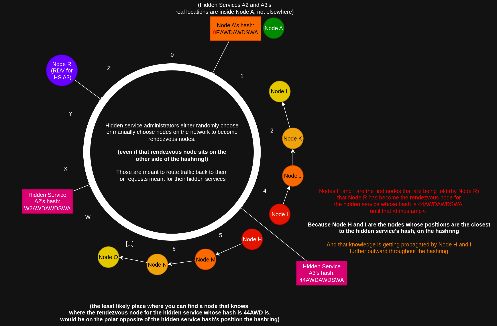

The least likely place where you can find a node that knows where the rendezvous node for the hidden service whose hash is 44AWDAWDSWA is, would be on the polar opposite of the hidden service hash's position the hashring.

When a given knowledge is past it's expiration timestamp, every node on the network deletes it, because past that timestamp, Node R is no longer allowed to route traffic for that hidden service hash.

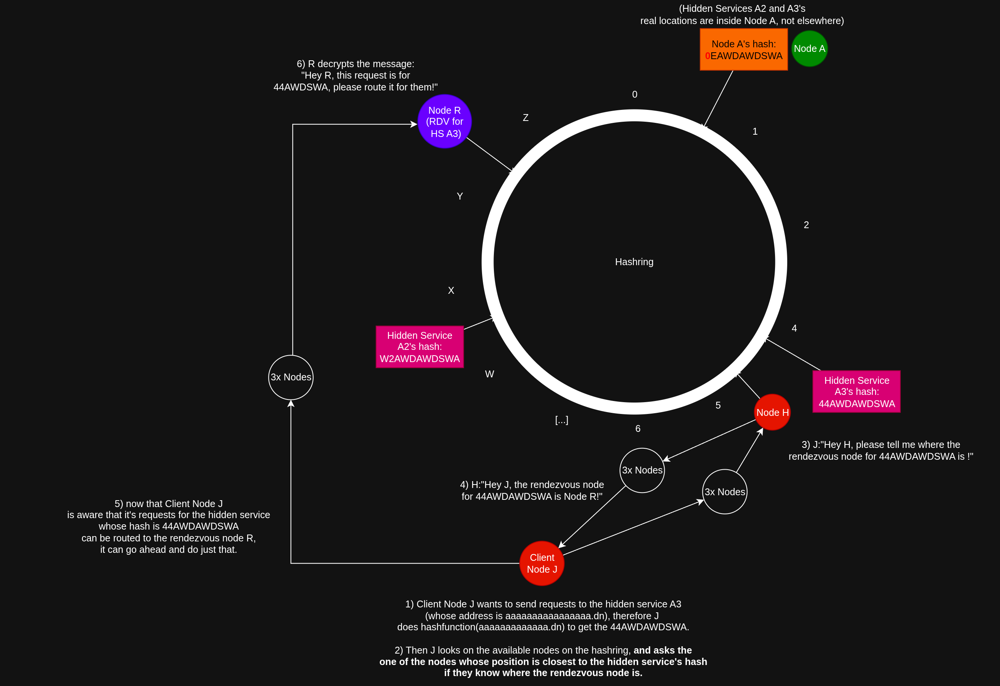

So given this mechanism, Client Node J can request Node H (which is closest to the hidden service's hash position on the hashring), to tell him where the rendezvous node for 44AWDAWDSWA is, Node H does know that information and responds to Node J telling him that Node R is the one he's looking for.

So Node J connects to Node R and sends his requests for the hidden service whose hash is 44AWDAWDSWA to them.

### Nodes can ask other nodes to route traffic for them, depending on the requested hash

In our previous example, Node A requested the rendezvous node R to route requests for 44AWDAWDSWA to Node S and S2 as 33AWDAWDSWA requests.

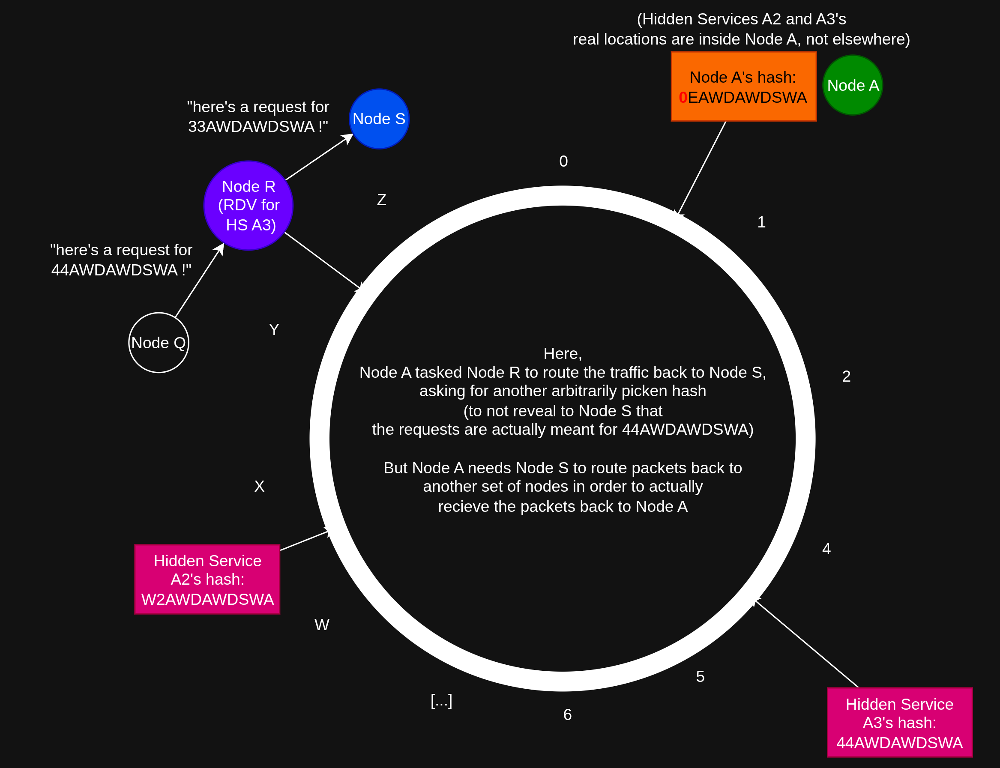

The problem here is that Node A needs Node S to continue routing the requests back to Node A, via other nodes.

So this feature is meant to do just that: you can request Nodes to route traffic for you, based on the hash that's being requested to them, and you can tell them to route the traffic to other nodes asking for a different hash aswell:


So in our above example we get the following result if Node A asks nodes S, T and U to route traffic for them:

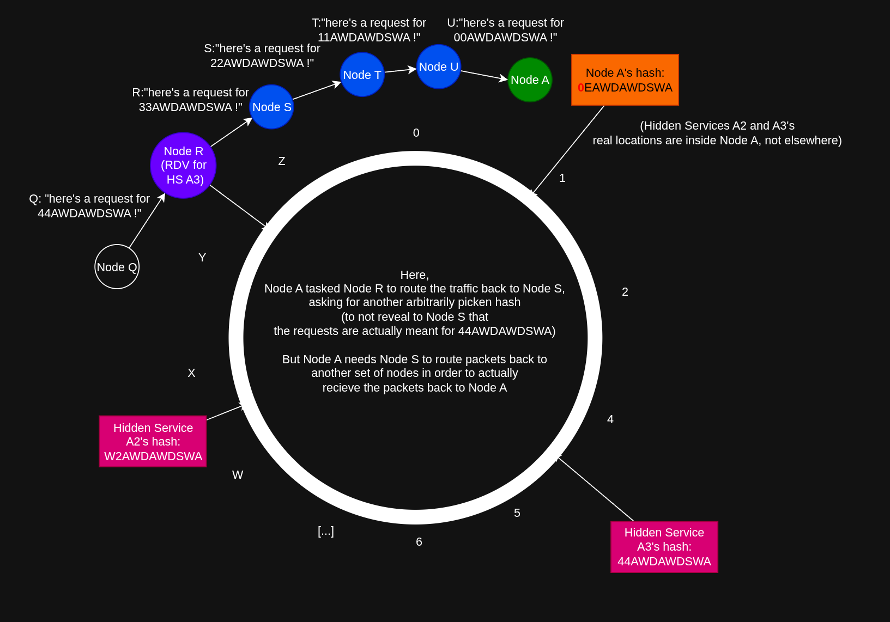

Thanks to this mechanism, Node A is able to recieve traffic meant for it's own hidden service, from it's designated rendezvous node(s) back to itself, **without revealing to neither Nodes S, T, or U that the requests are meant for the hidden service whose hash is 44AWDAWDSWA.**

## Hidden Services are told where to route responses back to a rendezvous node chosen by the clients:

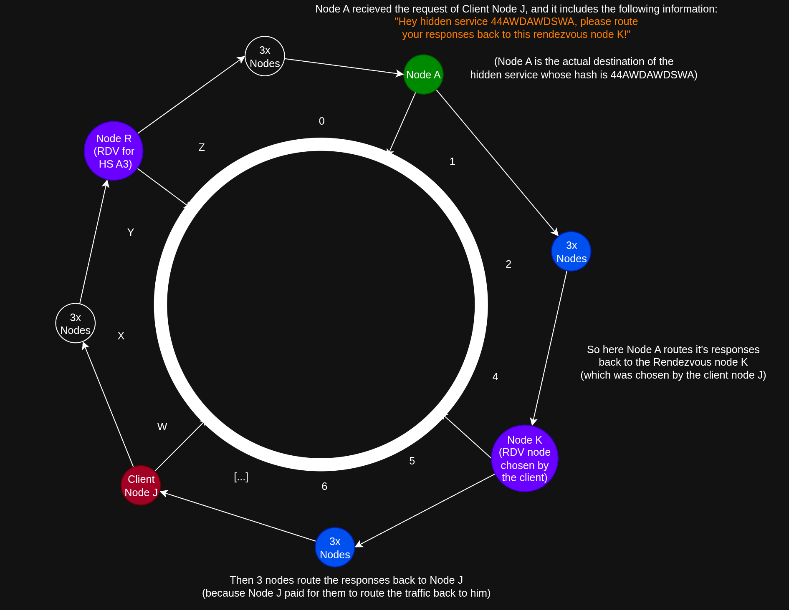

In order for clients to recieve responses from hidden services, they have to tell them where to route traffic back to. 

Therefore in the same fashion that hidden services pick a rendezvous node to be able to recieve traffic that's meant for them, we have clients choosing rendezvous nodes to be able to recieve traffic that's meant for them, coming from hidden service destinations, allowing them to remain anonymous from a potentially malicious hidden service.

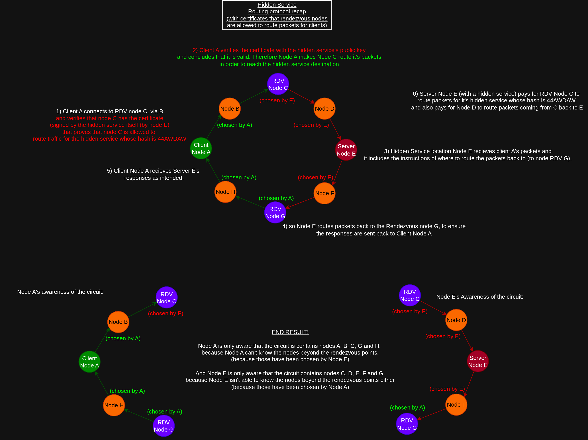

to recapitulate, Client nodes connect to a rendezvous node chosen by the hidden service to forward their requests to the hidden service, and the hidden service connects to a rendezvous node chosen by the client to forward their responses back to the client.

Effectively preserving the bi-directionnal anonymity, from clientside to serverside, using unidirectionnal streams.

### Decoy Destinations and Decoy Sources

#### The Justification behind Decoy Destinations and Decoy Sources:


As it was said previously in the threat model, the malicious client Node A with the capability of a global passive adversary will try to correlate the amount of data they send to a given hidden service, and the amount of data that is being received by other nodes on the network.

Over time, if the adversary sends 100Gb of data to one hidden service, and the only node to have received that 100Gb of data is Node B, **then the adversary would have successfully deanonymized the hidden service as being on Node B.** Therefore, Node B can't be the only one to receive 100Gb of data and send 50Gb of response data over time. **This is the main justification behind the Decoy Destinations feature.**

The opposite also holds true, you can't let a malicious hidden service operator deanonymize clients:

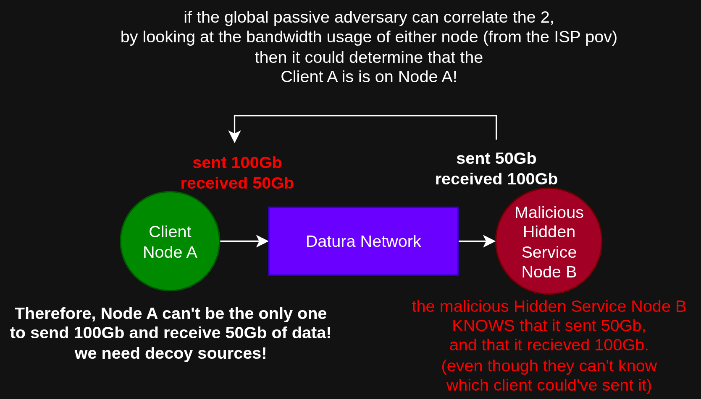

A malicious hidden service operator is also able to know that they received 100Gb and sent 50Gb worth of traffic, and if they have the monitoring capability of a global passive adversary, then they could be able to deanonymize a given client, (if they were the sole client that visited the hidden service), **which justifies our Decoy Sources feature.**

#### The connection Layout of the Decoy Destinations and Sources:


in the center we have our client and server, Client Node A, and Hidden service Node B. 

Client Node A paid (in PoW), for a total of 20 nodes, including all of the nodes on the bottom half of the graph and RDV Node D11 to ensure that Decoy Source Nodes 12 to 18:

 - receive the same traffic that Client Node A receives (even though only Client Node A can decrypt it)
 - send the same traffic shape that Client Node A sends

in the upper half of the graph we have the 20 nodes that the hidden service Node B also paid for (in PoW) which includes RDV Node D1, to ensure that Decoy Destination Nodes 2 to 8:

- receive the same traffic that Hidden Service Node B receives (even though only Hidden Service Node B can decrypt it)
- send the same traffic shape that Hidden Service Node B sends

#### Decoy Sources: The Sequence to send requests to hidden services:

The sequence to send requests to hidden services is as follows:

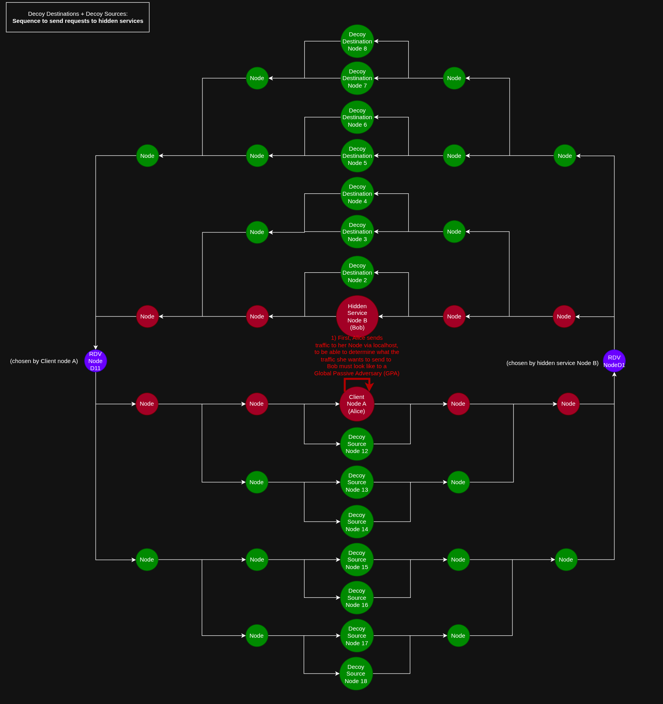

1) First, Alice sends traffic to her Node via localhost, to be able to determine what the traffic she wants to send to Bob must look like to a Global Passive Adversary (GPA)


2) Alice sends the information of what the traffic must look like to RDV Node D11, by going through RDV Node D1
3) RDV Node D1, (which was chosen by the hidden service node B), routes the traffic to the decoy destinations
4) All decoy destination nodes recieve the packet and are told to forward it back to the RDV node chosen by the client
5) RDV Node D11, (which was chosen by the client A), forwards the message back to the decoy sources to tell them what the traffic they must send looks like
6) all 8 sources (7 decoy sources, 1 real source), are told what the traffic they must send looks like, so they send it (only 1 traffic is real, the 7 others just send noise traffic that looks exactly the same from the outside)


7) now that all 8 sources are told what the traffic they must send looks like, they all send it to RDV node D1
8) RDV Node D1 forwards the real traffic to all 8 Decoy Destinations (and discards the 7 other noise traffic)
9) All 8 destinations recieve the same traffic

End result: is that if Node B is a malicious hidden service with the monitoring capability of a global passive adversary, Client A is not deanonymizing themselves with their bandwidth consumption to that adversary because there is always an anonymity set of 1 out of 8 possible sources (7 of which are decoy sources), that have sent the same amount of traffic to the RDV node D1 (which was chosen by the hidden service).

#### Decoy Destinations: The Sequence to receive responses from hidden services:

To receive responses from hidden services, the sequence is the same except that it starts with the Hidden Service instead:

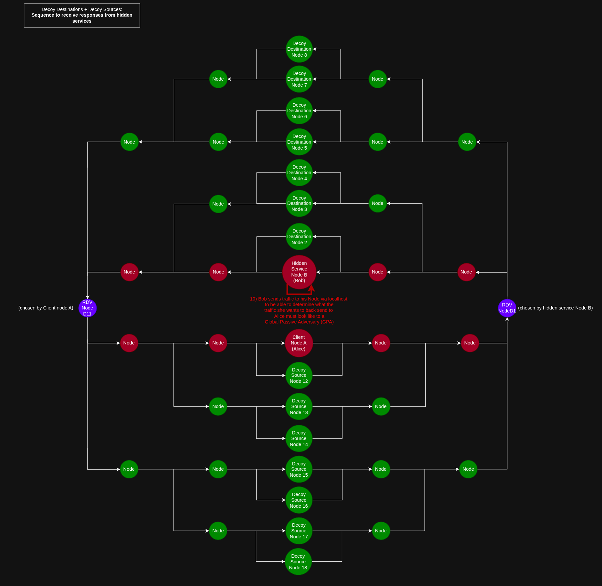

10) Bob sends traffic to his Node via localhost, to be able to determine what the traffic she wants to back send to  Alice must look like to a Global Passive Adversary (GPA)

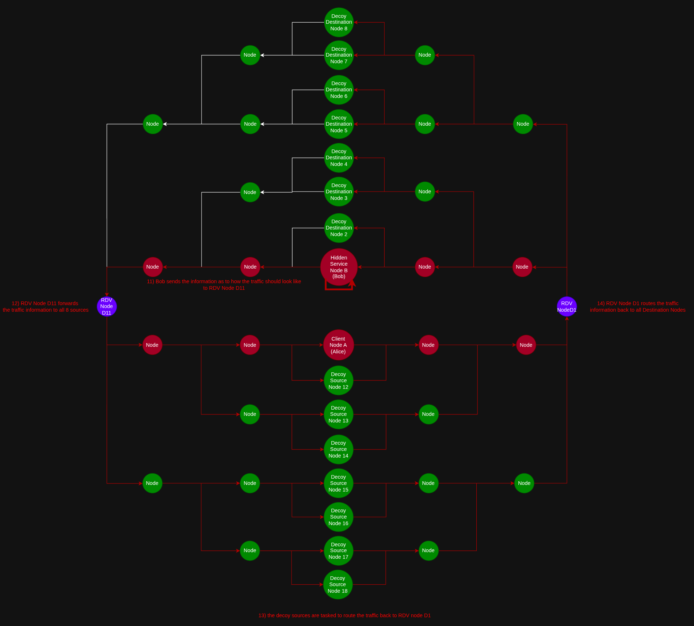

11) Bob sends the information as to how the traffic should look like to RDV Node D11
12) RDV Node D11 forwards the traffic information to all 8 sources
13) the decoy sources are tasked to route the traffic back to RDV node D1
14) RDV Node D1 routes the traffic information back to all Destination Nodes

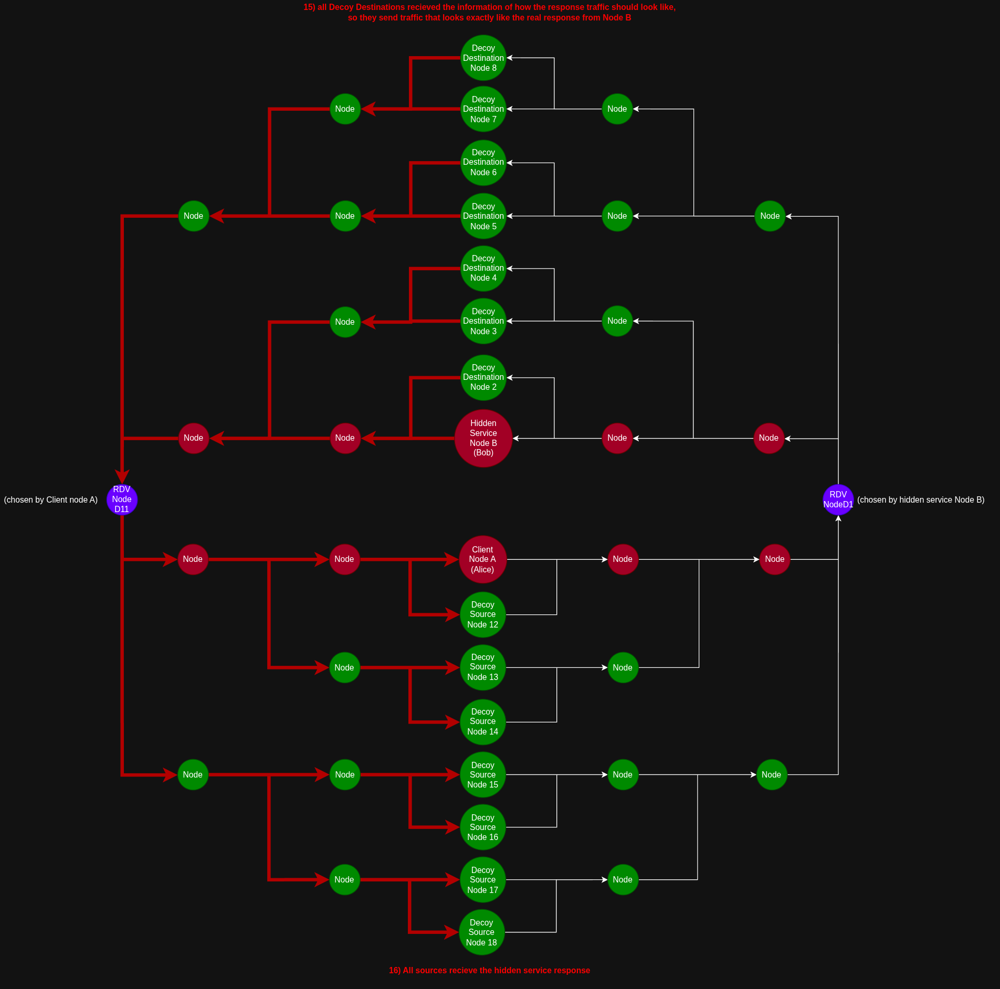

15) all Decoy Destinations recieved the information of how the response traffic should look like, so they send traffic that looks exactly like the real response from Node B
16) All sources recieve the hidden service response, via RDV Node D11.

End result: even if client Node A is a malicious adversary with the capabilities of a global passive adversary, they can't deanonymize Hidden service Node B via their bandwidth consumption because they always have an anonymity set of 1 out of 8 possible destinations (7 of which are decoy destinations), all 8 destinations have sent 50 Gb of traffic, and all 8 destinations have received 100Gb of traffic.

#### Bonus: Decoy Sources and Destinations combined with probabilistic path lengths:

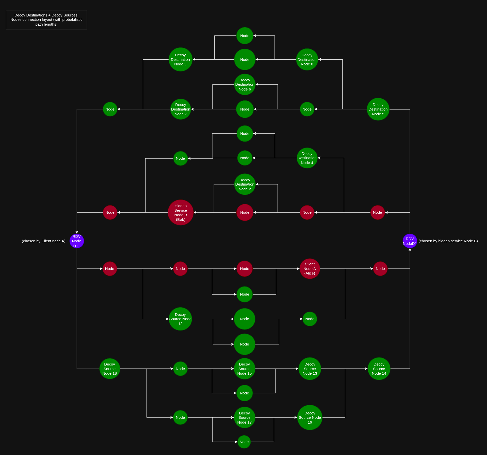

#### Bonus: non-default Decoy sources and destinations (reduced anonymity sets for lower bandwidth consumption and lower latency)

If the clients or hidden service administrators choose, they can configure their nodes to consume less bandwidth and send their packets around the network with lower latency, at the cost of having a lower anonymity set:

1/6 anonymity set:

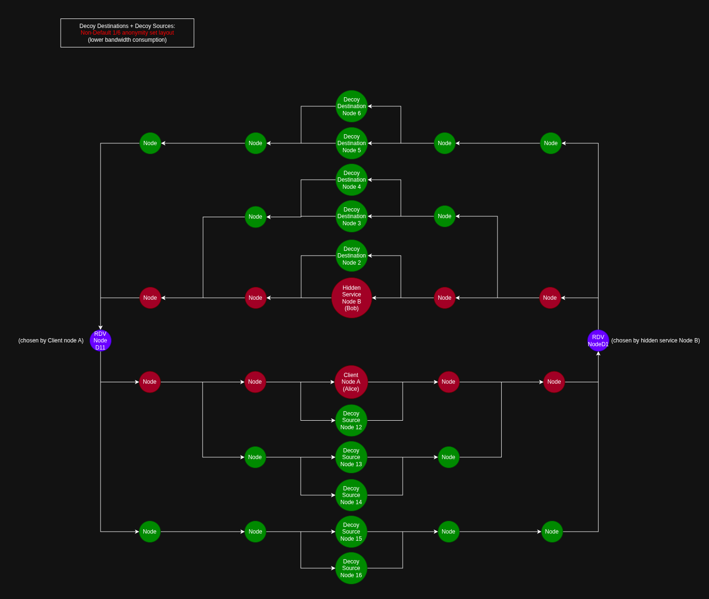

1/4 anonymity set:

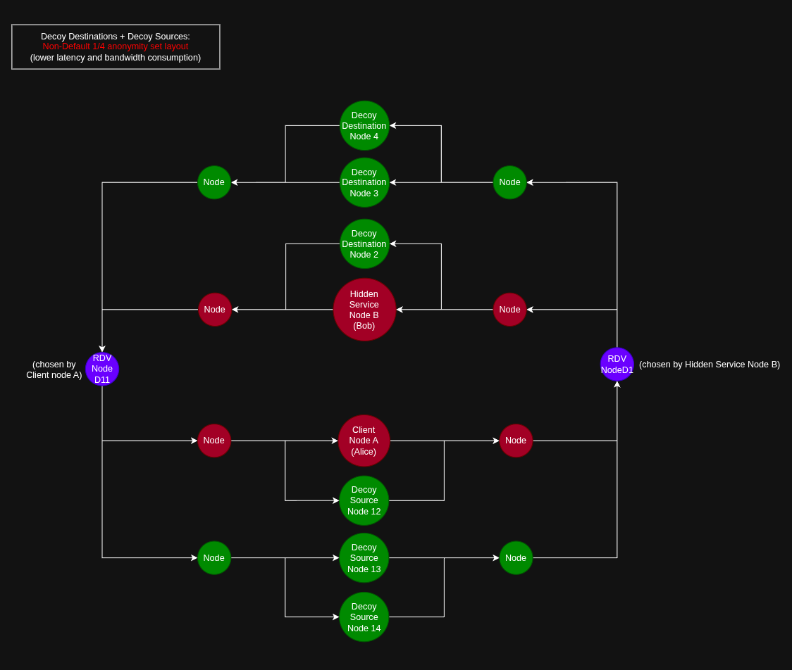

1/2 anonymity set:

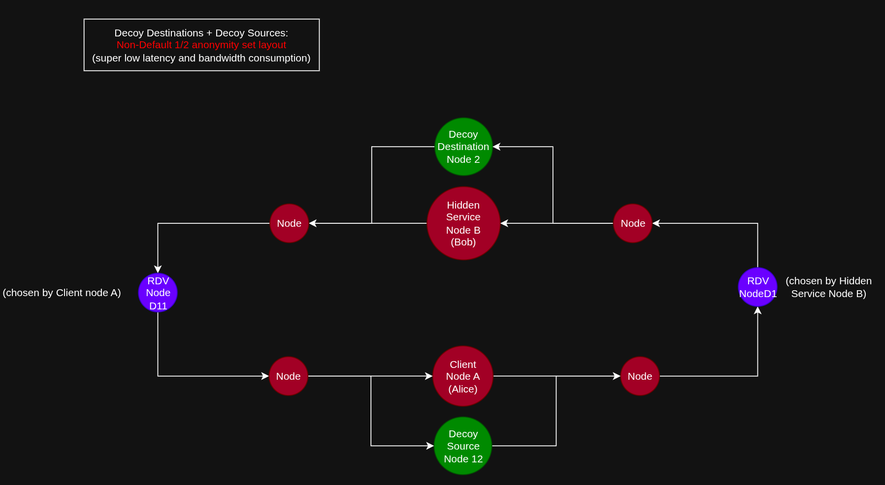

1/1 anonymity set:

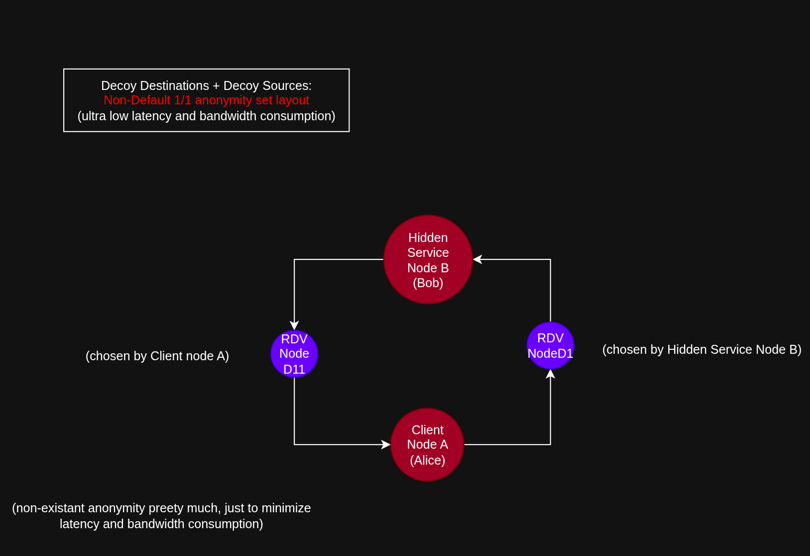

Take note that this is also the smallest hashring that there can be on the datura network, there needs to be at least 4 nodes for the network to be able to function.

### Datura Exit Nodes to access other Darknets (like Tor and i2p)

Datura Network will also enable users to talk to other darknets like Tor or i2p, thanks to exit nodes. There will be Datura nodes which will be marked as either Tor or i2p exit nodes:

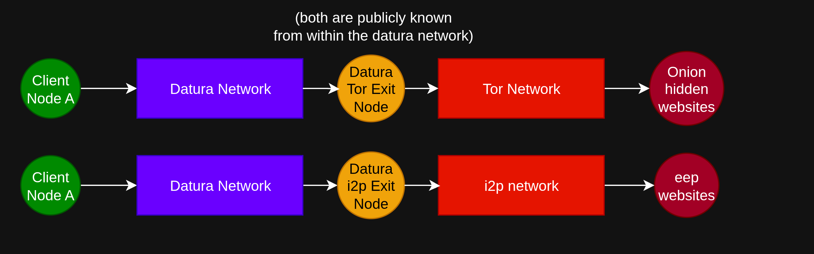

Therefore if client A wants to access an onion or i2p website via Datura network, it will be possible. the network will simply route their request through a Datura tor or i2p exit node, which will interface with the other networks accordingly, which will also enable to access those websites anonymously.

### Secret Datura Exit Nodes to access the clearnet 

By default, the Datura Network users will be able to access the clearnet via the network's Datura Tor exit nodes, to be able to access the clearnet, through the Tor exit nodes. **The obvious drawback to this is that Tor exit nodes are publicly listed by torproject, this makes it so that the websites that are being accessed via Tor are aware that they are being accessed anonymously**, that's obviously not ideal because the anonymous user can easily be blocked because of it.

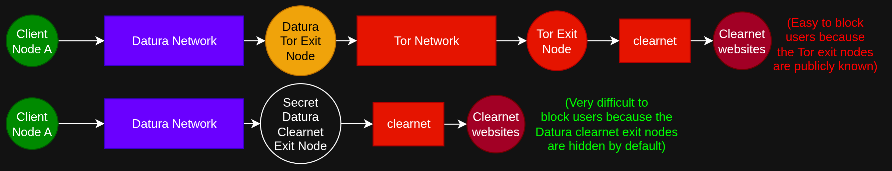

To solve this problem, Datura network will have secret clearnet exit nodes. Those are going to be Datura Nodes which will secretely route users' traffic directly to the clearnet. **The catch here is that the users will need to pay a premium in Monero to be able to get ONE exit node revealed to them.** Not even the Datura Network itself will be able to determine if a given node is a clearnet exit node or not, the only way to know if a given datura node is an exit node, is to have already been told that it is an exit node.

Datura Exit node runners will be provided the following:

- a complete tutorial on how to run clearnet exit nodes
- a basic php / html website template to enable them to :
    - list the tor exit nodes that are being ran by the administrator (this list is hidden by default)
    - interface with a local monero node RPC
    - configure the cost of having an exit node revealed to the users
    - configure the amount of seats that a given exit node has (to restrict the maximum amount of users that can pay to get an exit node revealed to them)
    - publicly display if there are still seats available or not
    - allow users to send their transaction ids (txids) to the website if there are still exit node seats available
    - using those txids, the users will be able to get an exit node revealed to them (they only need to know one)
    - users will be able to top up their account (which was automatically created using their initial transaction id) every month, to be able to keep their seat to the given exit node.

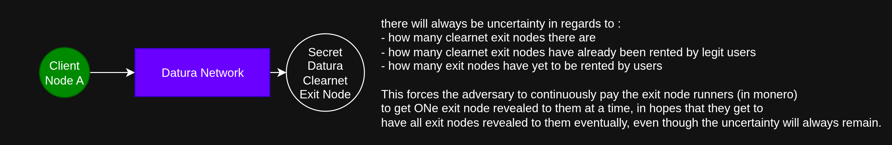

Given the current context of :

1) Statist paranoia regarding the freedom that anonymous online browsing provides
2) the very high public demand to be able to interact with the internet anonymously

the Datura exit nodes way of functionning will provide a clear incentive for exit nodes runners to contribute to the network in a financially-sustainable manner, because not only will they receive payments from legit users that are trying to access the clearnet anonymously, **they will also receive payments from the malicious adversary because they will be desperately trying to list those clearnet exit nodes.**

The Adversary is essentially going to be forced to anonymously pay the exit node runners in monero to get ONE random clearnet exit node revealed to them at a time. The adversary is forced to continuously pay datura exit node runners non-stop, to try and know as many clearnet exit nodes as possible, **but even then the full extent of exit nodes that exist will always remain uncertain to them**, because:
- there will always be exit nodes that have been fully rented by legit users before them, so if a given exit node with 100 seats is continously solely rented by legit users, then that exit node won't ever be doxxed and will remain unknown to the adversary.
- even if there are seats available still, the adversary has no way to know if the remaining available seats are for one clearnet exit node, or for 100 exit nodes. 

There will always be uncertainty in regards to the amount of exit nodes that have been rented out by legit users in the past, and the current amount of exit nodes that are yet to be rented out.

Once an exit node is revealed to a user, all they need to do is use the given node's hash in their own node's configuration, to constantly route clearnet traffic to that node in particular.